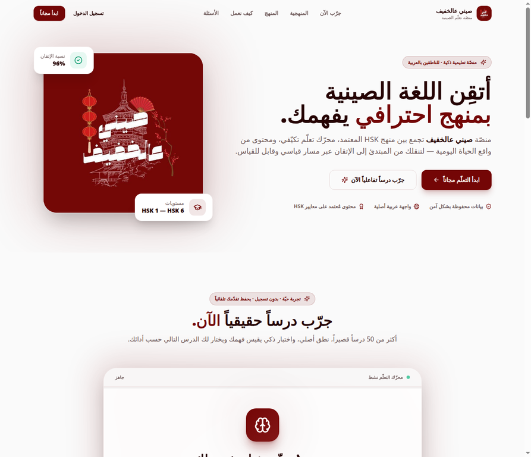

# 🇨🇳 صيني عالخفيف | Sini Al-Khafif 🎓
### AI-Powered Chinese Language Learning Platform for Arabic Speakers

**Sini Al-Khafif** is a state-of-the-art educational platform designed to take Arabic speakers from absolute beginners to advanced Chinese proficiency (HSK 1–6). By combining an adaptive learning engine with an intuitive Arabic interface, the platform offers a seamless and personalized learning journey.

---

## 🌟 Key Features

- **Adaptive Learning Engine:** A real-time engine that analyzes student performance and dynamically adjusts the curriculum to focus on weak points.
- **HSK-Aligned Curriculum:** Full coverage of the HSK 1–6 standard, featuring over 3,000 essential words and phrases.
- **Real-Life Context:** Every word is taught within 6–9 practical, real-life sentences to ensure usage over rote memorization.
- **5-Skill Integration:** Integrated training for Listening, Speaking, Reading, Writing (Characters), and Sentence Construction.
- **Progress Tracking:** Detailed analytics and cloud-synced progress reports for every student.

---

## 📸 Platform Preview

---

## 🛠️ Tech Stack & Architecture

- **Frontend:** Modern, responsive UI built for Arabic RTL support.
- **Backend:** Scalable architecture handling adaptive learning logic and user progress tracking.
- **Algorithms:** Implementation of Spaced Repetition (SM-2) for optimized vocabulary retention.
- **Security:** Secure user data management and cloud synchronization.

---

## 🚀 Live Demo
Visit the live platform: [https://sinialkhafifapp.com](https://sinialkhafifapp.com)

---

## 👨‍💻 Developed By
**Majid Al-Sakani**
*Full Stack Developer | Backend Engineer | Automation Specialist*

---

  <em>Building the future of intelligent language education.</em>

