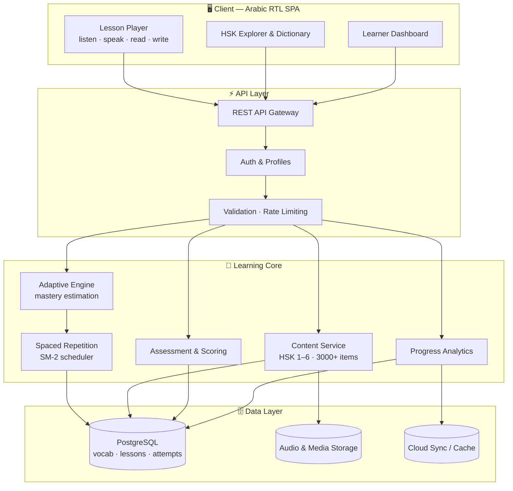
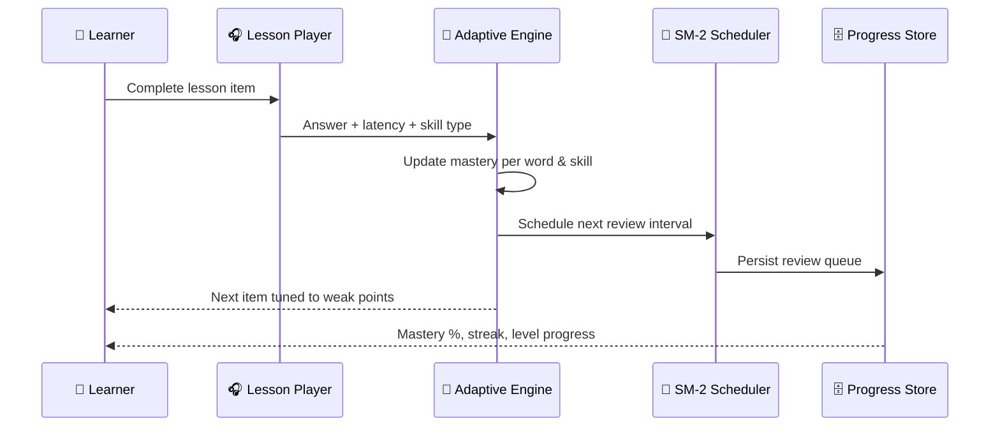

  

<h1 align="center">🇨🇳 صيني عالخفيف | Sini Al-Khafif 🎓</h1>
<h3 align="center">AI-Powered Chinese Language Learning Platform for Arabic Speakers</h3>

  
  
  
  
  

  
  
  
  
  
  
  

---

**Sini Al-Khafif** is a state-of-the-art educational platform designed to take Arabic speakers from absolute beginners to advanced Chinese proficiency (HSK 1–6). By combining an adaptive learning engine with an intuitive Arabic interface, the platform offers a seamless and personalized learning journey.

**صيني عالخفيف** منصّة تعليمية ذكية تنقل الناطقين بالعربية من الصفر إلى الإتقان في اللغة الصينية عبر منهج HSK المعتمد، محرّك تعلّم تكيّفي يحلّل الأداء لحظياً، ومحتوى مبني على واقع الحياة اليومية — بواجهة عربية أصلية من اليمين إلى اليسار.

> 🌐 **منصّة حيّة في الإنتاج:** [https://sinialkhafifapp.com](https://sinialkhafifapp.com) — أكثر من 46 درساً تفاعلياً، قاموس صيني–عربي، ودليل HSK كامل.

---

## 🌟 Key Features | أبرز المزايا

<table>
<tr>
<td width="33%" align="center"></td>
<td width="33%" align="center"></td>
<td width="33%" align="center"></td>
</tr>
<tr>
<td align="center"><b>🧠 Adaptive Learning Engine</b> محرّك تكيّفي يحلّل الأداء لحظياً ويعيد ترتيب المحتوى ليطابق نقاط الضعف</td>
<td align="center"><b>🎓 HSK 1–6 Curriculum</b> تغطية كاملة لمنهج HSK بأكثر من 3,000 مفردة وعبارة أساسية</td>
<td align="center"><b>🗣️ 5-Skill Integration</b> استماع، نطق، قراءة، كتابة الحروف، وتركيب الجمل في درس واحد متماسك</td>
</tr>
</table>

- **Adaptive Learning Engine:** A real-time engine that analyzes student performance and dynamically adjusts the curriculum to focus on weak points.
- **HSK-Aligned Curriculum:** Full coverage of the HSK 1–6 standard, featuring over 3,000 essential words and phrases.
- **Real-Life Context:** Every word is taught within 6–9 practical, real-life sentences to ensure usage over rote memorization.
- **5-Skill Integration:** Integrated training for Listening, Speaking, Reading, Writing (Characters), and Sentence Construction.
- **Progress Tracking:** Detailed analytics and cloud-synced progress reports for every student.
- **Chinese–Arabic Dictionary:** Free HSK dictionary with pinyin, tones and Arabic meanings.
- **Free Interactive Trial:** Try a real lesson instantly — no signup required, progress saved locally.
- **Arabic-First RTL Experience:** Typography, layout and pedagogy designed natively for Arabic speakers.

---

## 📸 Platform Preview | جولة داخل المنصّة

### 🏠 Landing Page — `sinialkhafifapp.com`

### 🧪 Interactive Lesson Demo & Platform Stats

### 🧭 Methodology — Four Academic Pillars

### 🎓 HSK 1–6 Guide

### 📗 HSK 1 Level Page

### 📚 Chinese–Arabic HSK Dictionary

### ℹ️ About the Platform

Original preview kept for reference: <code>screenshots/landing_page.webp</code>

---

## 🏗️ Architecture | معمارية النظام

### 🔄 Adaptive Learning Loop

---

## 🛠️ Tech Stack & Engineering Notes

| Layer | Technology | Engineering Notes |
|-------|-----------|-------------------|
| **Frontend** | React · TypeScript · TailwindCSS | RTL-first design system, accessible components, code-split routes |
| **Backend** | Scalable REST services | Adaptive logic, assessment scoring, progress aggregation |
| **Database** | PostgreSQL | Normalized vocab/lesson/attempt model, indexed lookups |
| **Algorithms** | Spaced Repetition (SM-2) | Per-word mastery decay and optimal review intervals |
| **Media** | Native-speaker audio pipeline | Pronunciation per word and per sentence |
| **Security** | Secure auth + cloud sync | Protected learner data, row-level access rules |
| **SEO** | Semantic HTML · metadata · structured data | Indexable HSK level pages with Arabic keyword targeting |
| **Performance** | Caching, lazy media, image optimization | Tuned for mobile and low-bandwidth networks |

**Engineering principles:** clean separation of concerns · deterministic scheduling · defensive validation · analytics-driven pedagogy · accessibility and RTL correctness · security by default.

---

## 🚀 Roadmap

- [ ] Speech recognition for pronunciation scoring (tones)
- [ ] Handwriting recognition for character writing practice
- [ ] Mobile apps (iOS / Android) with offline lessons
- [ ] AI conversation tutor for real dialogue practice
- [ ] Teacher/classroom dashboards and cohort analytics
- [ ] Public HSK dictionary API

---

## 🌐 Live Platform

| Section | Link |
|---------|------|
| 🏠 Home | https://sinialkhafifapp.com |
| 🎓 HSK 1–6 | https://sinialkhafifapp.com/hsk |
| 📗 HSK 1 | https://sinialkhafifapp.com/hsk/1 |
| 📚 Dictionary | https://sinialkhafifapp.com/dictionary |
| 🧭 Methodology | https://sinialkhafifapp.com/methodology |
| ℹ️ About | https://sinialkhafifapp.com/about |
| ✉️ Contact | https://sinialkhafifapp.com/contact |

---

## 👨‍💻 Developed By
**Majid Al-Sakani** — ماجد السكني
*Full Stack Developer | Backend Engineer | Automation Specialist*

  
  

> If this project inspires you, please ⭐ **star the repository**.

---

<!--
Keywords / كلمات مفتاحية:
Sini Al-Khafif, sinialkhafifapp, صيني عالخفيف, تعلم الصينية, تعلم اللغة الصينية للعرب, اللغة الصينية بالعربي,
HSK, HSK 1, HSK 2, HSK 3, HSK 4, HSK 5, HSK 6, اختبار HSK, منهج HSK, مفردات HSK, قاموس صيني عربي, بينيين, pinyin,
learn Chinese, learn Mandarin, Chinese for Arabic speakers, Mandarin course, Chinese vocabulary, Chinese characters,
adaptive learning, spaced repetition, SM-2, AI tutor, edtech, e-learning platform, language learning app,
interactive lessons, pronunciation practice, listening speaking reading writing, progress tracking, learning analytics,
React, TypeScript, TailwindCSS, PostgreSQL, Supabase, REST API, RTL web app, Arabic UI, full stack developer,
Majid Al-Sakani, ماجد السكني, مبرمج يمني, مطور فل ستاك, منصة تعليمية ذكية, ذكاء اصطناعي, تعليم إلكتروني
-->

  <em>Building the future of intelligent language education.</em> 
  <em>نبني مستقبل تعليم اللغات بالذكاء الاصطناعي.</em>

