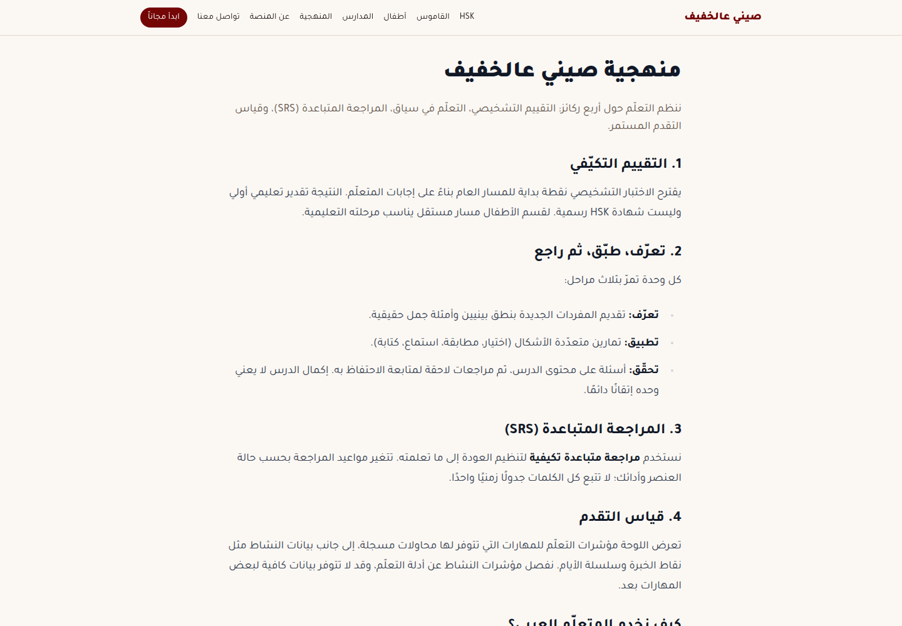
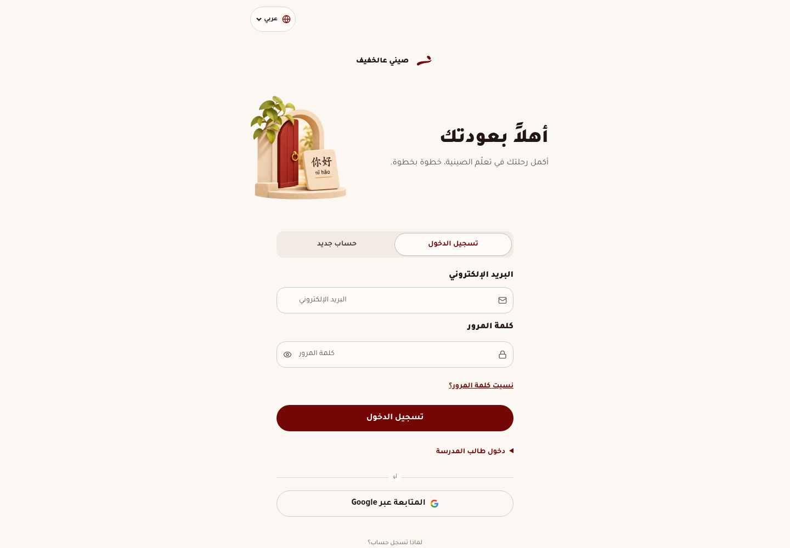

<p align="center">
  
</p>

<h1 align="center">🇨🇳 صيني عالخفيف | Sini Al-Khafif</h1>
<h3 align="center">تعلّم الصينية للناطقين بالعربية عبر مسار HSK 1–9</h3>
<p align="center"><i>دروس قصيرة، مفردات في سياق، ومراجعة خطوة بخطوة.</i></p>

<p align="center">
  <a href="https://sinialkhafifapp.com"></a>
  
  
  
</p>

<p align="center">
  <a href="https://sinialkhafifapp.com">الموقع والتجربة الحية</a> ·
  <a href="https://sinialkhafifapp.com/methodology">المنهجية</a> ·
  <a href="https://sinialkhafifapp.com/dictionary">القاموس الصيني–العربي</a>
</p>

---

## عن المشروع

**صيني عالخفيف** منصّة تعليمية للناطقين بالعربية، تساعد المتعلّم على دراسة الصينية من خلال واجهة عربية أصلية ومسار منظّم بحسب مستويات **HSK 1–9**. يذكر الموقع أن المنهج مبني على إطار **HSK 3.0**، وأن عمق المحتوى يختلف بين المستويات وأن المستويات المتقدمة ما زالت تتوسع.

تجمع تجربة الموقع بين دروس قصيرة، مفردات داخل سياق، تدريب على الاستماع، مراجعة متباعدة، متابعة للتقدم، وقاموس صيني–عربي. كما يعرض الموقع مسارًا تعليميًا للأطفال ومدخلًا للمدارس والمعلمين.

> **تنبيه عن نطاق هذا المستودع:** المستودع الحالي صفحة تعريفية ومواد عرض وصور؛ لا يحتوي الشيفرة المصدرية للتطبيق أو تعليمات بناء وتشغيله. لذلك لا تُعد المخططات أو أوصاف المنتج هنا تدقيقًا تقنيًا لتنفيذ الموقع. جرّب المنتج من [الموقع الحي](https://sinialkhafifapp.com).

## ما يعرضه الموقع حاليًا

- **واجهة عربية أصلية واتجاه RTL** مع شروح وأمثلة موجهة للمتعلّم العربي.
- **مسار HSK 1–9 وفق HSK 3.0:** التأسيس في 1–2، والتطوير في 3–6، والنطاق المتقدم في 7–9. يوضح الموقع أن مستوى التفصيل والتغطية يختلفان بين المستويات.
- **تجربة درس دون تسجيل:** يتيح الموقع تجربة درس قصيرة قبل إنشاء حساب، ويذكر أن تقدم التجربة يُحفظ على الجهاز.
- **تعلّم ومراجعة:** يقدم الموقع تسلسلًا من التعرّف والتطبيق إلى التحقق، مع مراجعات متباعدة تعود إلى العناصر التي تحتاج مراجعة.
- **قاموس صيني–عربي:** بحث عن الكلمات الصينية مع البينيين والمعنى العربي ونوع الكلمة وأمثلة، وفق وصف الموقع.
- **مسار للأطفال:** أنشطة تبدأ بالاستماع والتعرّف، ثم تتدرج إلى القراءة والكتابة والتواصل.
- **المنهجية:** تقييم تشخيصي أولي، تعلم داخل سياق، مراجعة متباعدة، ومؤشرات تقدم للمهارات التي تتوفر لها محاولات مسجلة.
- **بدء مجاني وخيارات اشتراك:** يذكر الموقع إمكانية البدء مجانًا بمستوى HSK 1 وبعض دروس HSK 2، مع باقات للاطلاع على بقية المسار.

ابدأ من [الصفحة الرئيسية](https://sinialkhafifapp.com) أو اقرأ [شرح المنهجية](https://sinialkhafifapp.com/methodology).

## الخطة التسويقية

أُعدّت [خطة تسويق عربية لمدة 90 يومًا](MARKETING_PLAN_AR.md) تشمل التموضع، الجمهور، القنوات والمحتوى، القياس، وخطوات الجاهزية قبل الإعلانات.

## خريطة التعلّم

| المرحلة | المستويات | المحور كما يصفه الموقع |
|---|---|---|
| التأسيس | HSK 1–2 | التحية، الأرقام، العائلة والحياة اليومية البسيطة |
| التطوير | HSK 3–6 | العمل، النقاش، الثقافة والنصوص الأطول |
| النطاق المتقدم | HSK 7–9 | الخطاب الأكاديمي والمهني والترجمة |

المستويات ليست متساوية في عمق المحتوى؛ يوضح الموقع أن مواد النطاق المتقدم تتوسع تباعًا. راجع الصفحات الحية لمعرفة التغطية المتاحة حاليًا.

## كيف تتم تجربة التعلّم؟

1. يجيب المتعلم عن تقييم تشخيصي قصير يساعد على اقتراح نقطة بداية. النتيجة تقدير تعليمي أولي وليست شهادة HSK رسمية.
2. يتعرف على كلمات جديدة مع البينيين والمعنى العربي وأمثلة.
3. يطبق ما تعلمه عبر أنواع مختلفة من التمارين، بحسب ما هو متاح في الدرس.
4. يعود إلى مراجعات لاحقة لمتابعة الاحتفاظ بالمفردات والتقدم.

تشرح [صفحة المنهجية](https://sinialkhafifapp.com/methodology) أن إكمال الدرس وحده لا يثبت إتقانًا دائمًا، وأن بعض مؤشرات المهارات قد لا تتوفر لها بيانات كافية في البداية.

## الشعار ولقطات الواجهات الحالية

أُخذت أصول الهوية التالية من الموقع الحي، مع الاحتفاظ بالأيقونة المتجهية ونسخ PNG المستخدمة كأيقونات للمتصفح والأجهزة:

<p align="center">
  
</p>

- SVG: [`assets/brand/app-icon.svg`](assets/brand/app-icon.svg) و[`assets/brand/favicon.svg`](assets/brand/favicon.svg)
- PNG: [`favicon.png`](assets/brand/favicon.png)، [`icon-192.png`](assets/brand/icon-192.png)، و[`apple-touch-icon.png`](assets/brand/apple-touch-icon.png)

الصور التالية لقطات مباشرة من الصفحات العامة وقت تحديث المستودع. اضغط على أي صورة لفتح نسختها كاملة الدقة. قد تتغير الصفحات الحية بعد تاريخ الالتقاط.

<table>
  <tr>
    <td width="50%" align="center"><a href="screenshots/current/home.png"></a><br/><b>الصفحة الرئيسية</b></td>
    <td width="50%" align="center"><a href="screenshots/current/curriculum.png"></a><br/><b>دليل HSK</b></td>
  </tr>
  <tr>
    <td width="50%" align="center"><a href="screenshots/current/dictionary.png"></a><br/><b>القاموس الصيني–العربي</b></td>
    <td width="50%" align="center"><a href="screenshots/current/methodology.png"></a><br/><b>المنهجية</b></td>
  </tr>
  <tr>
    <td width="50%" align="center"><a href="screenshots/current/auth.png"></a><br/><b>تسجيل الدخول</b></td>
    <td width="50%" align="center"><a href="screenshots/current/signup.png"></a><br/><b>إنشاء حساب</b></td>
  </tr>
</table>

وتشمل اللقطات الكاملة الإضافية صفحات [HSK 1](screenshots/current/hsk-1.png)، [عن المنصة](screenshots/current/about.png)، و[التواصل](screenshots/current/contact.png). أما الصور القديمة في [`screenshots/`](screenshots/) و[`screenshots/live/`](screenshots/live/) فهي أرشيف مرئي من إصدارات سابقة؛ راجع الموقع الحي للتصميم الأحدث.

## ملاحظات الدقة والخصوصية

- الصفحة الرئيسية تعرض حاليًا إشارتين مختلفتين لعدد الدروس: **46+** و**أكثر من 50**. لذلك لا نثبت رقمًا إجماليًا في هذا README إلى أن يوحّد الموقع هذا الرقم.
- يصف الموقع تجربة الدرس دون تسجيل بأنها تحفظ التقدم على الجهاز. وتذكر أجزاء أخرى من الموقع حفظًا سحابيًا للتقدم. لا يحتوي هذا المستودع على شيفرة التطبيق التي تسمح بالتحقق من نطاق المزامنة أو تفاصيل تخزين البيانات؛ راجع سياسة الموقع وإعدادات حسابك قبل الاعتماد على المزامنة بين الأجهزة.
- أوصاف «التكيّف» و«المراجعة المتباعدة» هنا تلخص ما يعلنه الموقع عن تجربة المنتج؛ هذا المستودع لا يتضمن الشيفرة أو الاختبارات اللازمة لتدقيق الخوارزمية.
- لم نضع في هذا README أرقامًا عن رضا المتعلمين أو حجم الاستخدام أو عدد المفردات ما لم تكن ظاهرة ومحدّثة بوضوح على الموقع.

## بنية المستودع

```text
.
├── README.md
├── assets/
│   ├── brand/       # شعار وأيقونات مأخوذة من الموقع الحي
│   └── ...          # مواد تعريفية سابقة
└── screenshots/
    ├── current/     # لقطات حديثة لصفحات الموقع
    └── ...          # لقطات أرشيفية من إصدارات سابقة
```

هذا المستودع **ليس نسخة قابلة لبناء تطبيق الويب**؛ فهو لا يحتوي ملفات الواجهة أو الخادم أو إعدادات قاعدة البيانات. إذا كنت تبحث عن استخدام المنصة، فابدأ من الموقع الحي. وإذا كنت تبحث عن المساهمة في كود التطبيق، فاطلب الوصول إلى مستودع الشيفرة المناسب.

## روابط المشروع

| الصفحة | الرابط |
|---|---|
| الموقع الرئيسي | [sinialkhafifapp.com](https://sinialkhafifapp.com) |
| المنهجية | [sinialkhafifapp.com/methodology](https://sinialkhafifapp.com/methodology) |
| القاموس الصيني–العربي | [sinialkhafifapp.com/dictionary](https://sinialkhafifapp.com/dictionary) |
| المنهج | [sinialkhafifapp.com/hsk](https://sinialkhafifapp.com/hsk) |
| صفحة HSK 1 | [sinialkhafifapp.com/hsk/1](https://sinialkhafifapp.com/hsk/1) |
| تسجيل الدخول / إنشاء حساب | [sinialkhafifapp.com/auth](https://sinialkhafifapp.com/auth) |
| معلومات المشروع | [sinialkhafifapp.com/about](https://sinialkhafifapp.com/about) |
| التواصل | [sinialkhafifapp.com/contact](https://sinialkhafifapp.com/contact) |
| GitHub | [majid-alsakani/sini-alkhafif-app](https://github.com/majid-alsakani/sini-alkhafif-app) |

## المساهمات

هذا المستودع ينشر حاليًا مواد تعريفية وصورًا، ولا يتضمن مصدر التطبيق. قبل إرسال اقتراح يتطلب تعديل المنتج، تواصل مع صاحب المشروع لمعرفة مستودع الشيفرة أو آلية المساهمة المناسبة.

## المطوّر

**تطوير وإشراف: ماجد السكني | Majid Al-Sakani**
[GitHub](https://github.com/majid-alsakani) · [صيني عالخفيف](https://sinialkhafifapp.com)

---

<p align="center"><i>تعلّم الصينية بالعربي، خطوة بخطوة.</i></p>
